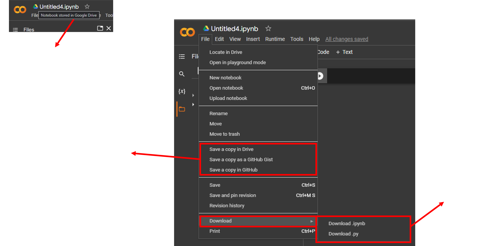

<h1 align="center"> Tools </h1>

# Google Colaboratory

    

Colab atau "Colaboratory", digunakan untuk menulis dan mengeksekusi Python melalui browser dengan keuntungan sebagai berikut:
- Tidak perlu konfigurasi
- Akses ke GPU secara gratis
- Mudah berkolaborasi dengan orang banyak (easy sharing)

## Bagian Esensial pada Colab
### 1. Fitur-fitur

    

    

### 2. Connect Runtime

    

### 3. Mengganti Tipe Runtime

    

    

### 4. Contoh Output

    

### 5. Saving

    

## Workflow
1. Buat file
2. Pilih jenis runtime
3. Connect runtime
4. Tulis Code
5. Eksekusi code
6. Save

## Additional Resources

Video: [Introduction to Colab](https://www.youtube.com/watch?v=inN8seMm7UI&ab_channel=TensorFlow)

Written Tutorial: 
[Basic Feature Overview](https://colab.research.google.com/notebooks/basic_features_overview.ipynb)

# Jupyter Notebook

    

